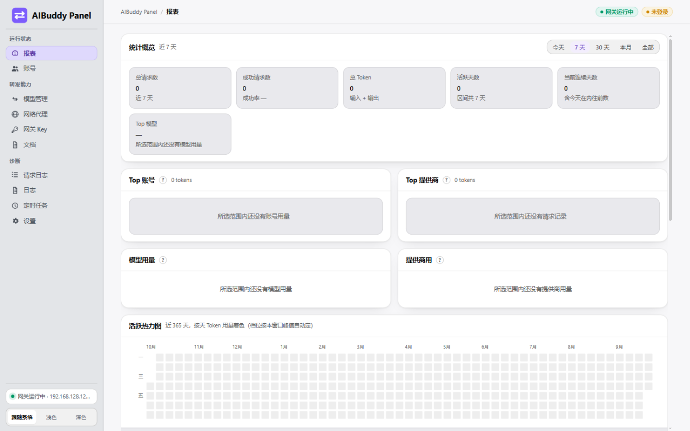
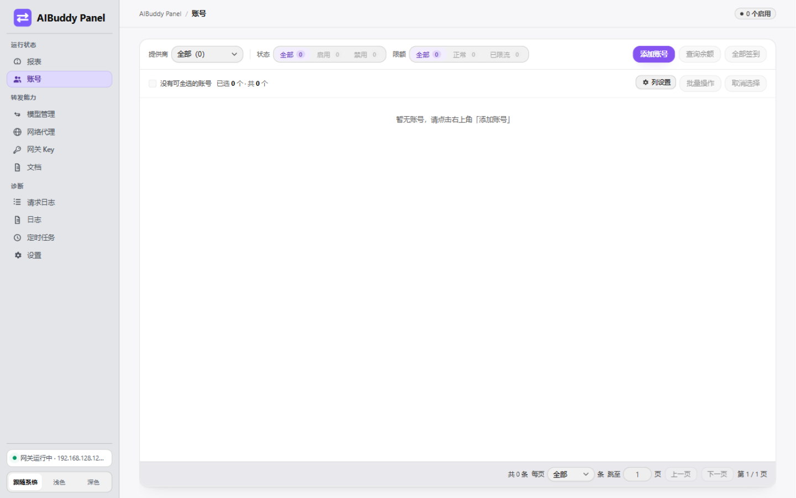
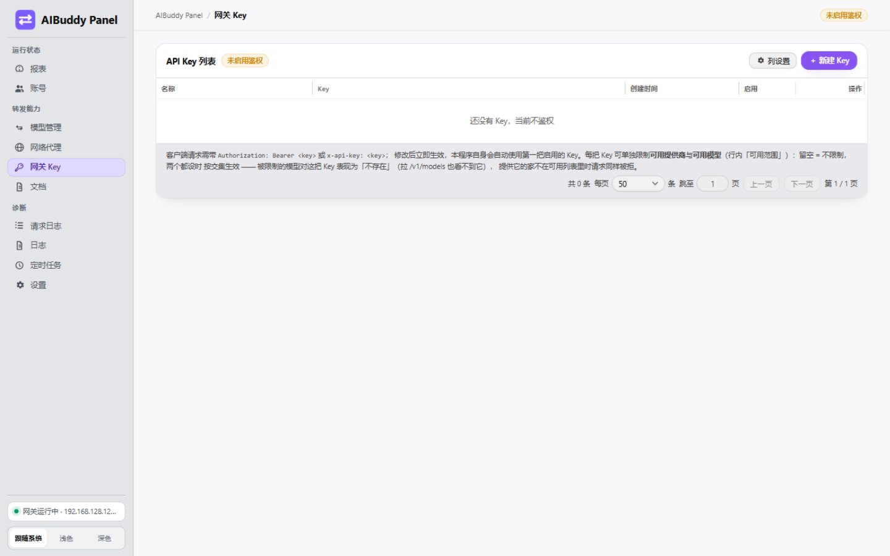
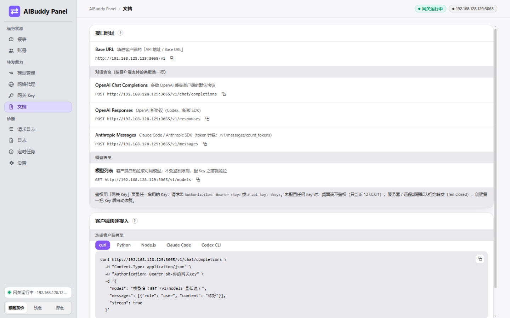
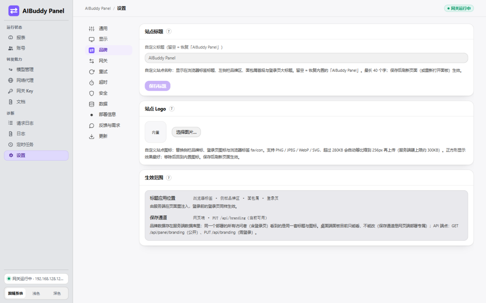

# AIBuddy Panel · 多提供商 AI 网关

**简体中文** · 多账号池 · 模型映射 · 品牌自定义 · OpenAI 兼容接口 · 请求报表

> 当前版本：**2.14.0**（更新明细见 [CHANGELOG.md](./CHANGELOG.md)）

AIBuddy Panel 把多家 AI 客户端 / 上游的额度包装成本地 **OpenAI 兼容 API 网关**：统一一个 `base_url`，自带多账号管理、全局优先级队列、429 自动降级、出站指纹脱敏、出网代理与请求报表，并提供 Web 管理面板与桌面端。任何支持自定义 `base_url` 的 OpenAI 客户端都能以 `http://127.0.0.1:3065/v1` 为端点调用这几家的模型额度——不需要改客户端源码。

```
OpenAI 客户端 / 任意 SDK
        │  POST /v1/chat/completions   （OpenAI 兼容，SSE）
        ▼
  AIBuddy Panel 网关
  模型映射 · 账号候选链（全局优先级）· 429 降级 · 出网代理 · 出站指纹脱敏
        │  HTTPS（按模型名决定去谁家）
        └──▶ WorkBuddy / 小浣熊 / CatPaw / AutoClaw / Qoder / Cline / Accio / CodeArts / Trae …
```

> **项目来源与致谢**：本项目基于 [aimod-cc/agent2api](https://github.com/aimod-cc/agent2api) 二次开发而来，多提供商协议引擎（各家客户端的登录态转发、签名、刷新等核心能力）全部来自原项目，感谢原作者 **aimod-cc** 的出色工作。二开部分（品牌外观、页面偏好、数据维护、部署信息、文档页增强等）见 [CHANGELOG.md](./CHANGELOG.md)。许可沿用上游 **MIT + 附加使用声明**（禁止商用与二次分发牟利），见 [LICENSE](./LICENSE)。

---

## 界面预览

**报表**：统计概览、Top 账号 / 提供商、模型与提供商用量、活跃热力图与缓存命中率趋势。



**账号**：所有提供商的账号排在同一条全局队列里，按优先级逐个尝试，支持批量操作、余额查询与签到。



**网关 Key**：为 API 客户端创建密钥，支持按提供商 / 模型限制可用范围。



**文档**：接口地址按访问域名自适应生成（远程部署显示完整域名），并按当前地址实时生成 curl / Python / Node.js / Claude Code / Codex CLI 五种客户端的接入配置，一键复制。



**品牌设置**：自定义站点标题与 Logo，保存后应用到浏览器标签、侧栏、登录页与 favicon——同一套面板，换上你自己的牌子。



---

## 功能特性

- **OpenAI 兼容网关**：`/v1/chat/completions`、`/v1/responses`、`/v1/messages`（Anthropic 协议）三种协议，SSE 流式转发
- **多账号池**：全局一条优先级队列，跳过禁用 / 不提供该模型 / 限额冷却中的账号；429 自动降级到下一个候选
- **模型管理**：模型启停 / 删除 / 映射，能力位（推理、视频输入等）可编辑
- **网关 Key**：多把 Key，按提供商 / 模型限定可用范围；未配 Key 时服务器部署默认拒绝转发（fail-closed）
- **品牌自定义**：站点标题、Logo、主题色与深浅模式偏好，全站（含登录页）生效
- **TagsView 页签栏**：页签式页面导航，配合 Ctrl+K 快速跳转
- **请求报表**：总请求数、成功率、Token 统计、Top 模型 / 账号 / 提供商、活跃热力图、缓存命中率
- **数据维护**：事件日志与请求记录的清理预览、分级清理、数据库在线压缩（VACUUM）
- **安全**：面板登录 ALTCHA 人机验证、登录会话管理、API Key 鉴权、出站指纹脱敏
- **定时任务**：自动签到、凭据维护、余额查询、版本检查
- **移动端自适应布局**：窄屏抽屉式侧栏、宽表格横向滚动、单列卡片

---

## 服务器部署（Docker）

镜像内含网关与完整管理面板，全部状态（SQLite / 配置 / 日志）落在 `./data` 一个卷里：

```bash
docker run -d --name aibuddy-panel --restart unless-stopped \
  -p 3065:3065 -v ./data:/data \
  aibuddy-panel:2.10.0   # 镜像包随 Release 附带：aibuddy-panel-<版本>-docker.tar.gz，docker load 即用
```

浏览器打开 `http://<主机>:3065`，首次进入注册管理员账号；在「网关 Key」页创建 API Key 后，`http://<主机>:3065/v1` 即 OpenAI 兼容端点。

自建镜像（推荐在本地虚拟机 / 开发机构建，服务器只 `load`）：

```bash
git clone https://github.com/LzxkJ04/AIBuddy-Panel.git
cd AIBuddy-Panel
docker build -t aibuddy-panel:2.10.0 .
docker save aibuddy-panel:2.10.0 | gzip > aibuddy-panel-2.10.0.tar.gz
# 上传到服务器后：
docker load < aibuddy-panel-2.10.0.tar.gz
```

> ⚠️ Rust 链接阶段内存占用较高，**小内存服务器（≤2GB）请勿直接在服务器上 `docker build`**，按上面的流程本地构建、服务器零编译上线。经验细节见 [PITFALLS.md](./PITFALLS.md)。

反向代理（nginx）需要关闭缓冲以支持 SSE 流式：`proxy_buffering off; proxy_read_timeout 3600s;`

## 桌面端

从 [Releases](https://github.com/LzxkJ04/AIBuddy-Panel/releases) 下载安装包（Windows NSIS / macOS DMG），装完即用，无需任何运行时。桌面端网关跑在应用进程内，默认监听 `127.0.0.1:3065`。

---

## 快速开始

1. 登录面板 →「账号」页 →「添加账号」，按各家支持的方式完成登录（网页登录 / 短信验证码 / 粘贴凭证）
2. 「网关 Key」页创建一把 API Key
3. 把任意 OpenAI 兼容客户端的 `base_url` 指向网关：

```bash
curl http://127.0.0.1:3065/v1/chat/completions \
  -H "Content-Type: application/json" \
  -H "Authorization: Bearer sk-你的网关Key" \
  -d '{"model":"模型名","messages":[{"role":"user","content":"你好"}],"stream":true}'
```

```python
from openai import OpenAI

client = OpenAI(base_url="http://127.0.0.1:3065/v1", api_key="sk-你的网关Key")
resp = client.chat.completions.create(
    model="模型名（GET /v1/models 里任选）",
    messages=[{"role": "user", "content": "你好"}],
)
print(resp.choices[0].message.content)
```

客户端自动拉取 `GET /v1/models` 可获取当前可用模型清单；三种对话协议共用同一套账号池，可随时切换。

---

## 项目结构

```
├── desktop-tauri/
│   ├── src-tauri/server/      # 网关本体（Rust crate，桌面与 headless 共用）
│   │   └── src/server/
│   │       ├── api/           # HTTP 路由（面板 / 网关 / 品牌外观 / 数据维护）
│   │       ├── core/          # 账号池、提供商协议、上游转发、更新
│   │       └── db/            # SQLite 单文件存储（唯一真相）
│   ├── ui/                    # 面板静态界面（构建产物）
│   ├── ui-islands/            # React 岛源码（Vite 构建，产物落 ui/islands/）
│   └── ui-kit/                # 私有组件库（Base UI + Tailwind v4）
├── assets/screenshots/        # 界面截图
├── CHANGELOG.md               # 更新日志
└── PITFALLS.md                # 开发 / 部署踩坑记录（先读再动手）
```

## 开发

```bash
# 界面（React 岛）
cd desktop-tauri/ui-kit && npm install
cd ../ui-islands && npm install && npm run build   # 产物落 desktop-tauri/ui/islands/

# Rust（桌面端，需要 MSVC 工具链）
cd desktop-tauri/src-tauri && cargo build

# Docker 镜像
docker build -t aibuddy-panel:<版本> .
```

## 使用声明与许可

- 本项目沿用上游 **MIT License + 附加使用声明**：个人学习交流使用；**禁止商业用途与二次分发牟利**；以非官方客户端形态转发自有账号的登录态可能违反上游服务协议，账号风险（风控 / 封禁）由使用者自行承担。完整条款见 [LICENSE](./LICENSE)。
- 本项目与腾讯（WorkBuddy）、美团（CatPaw）、商汤（小浣熊）、智谱（AutoClaw）、阿里巴巴（Qoder / Accio）、华为云（CodeArts）、字节跳动（Trae）、Cline 及其官方产品均无关。

## 致谢

- **[aimod-cc/agent2api](https://github.com/aimod-cc/agent2api)** —— 本项目的基座，全部多提供商协议引擎出自原作者之手，respect 🙏
- 所有通过 Issue / 反馈帮助改进的朋友
